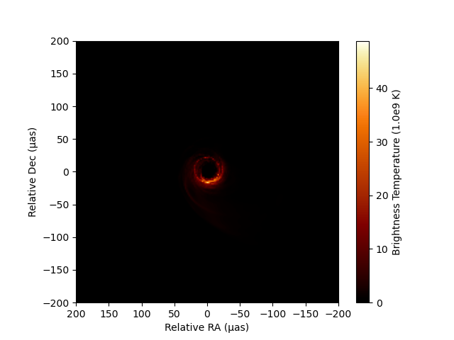
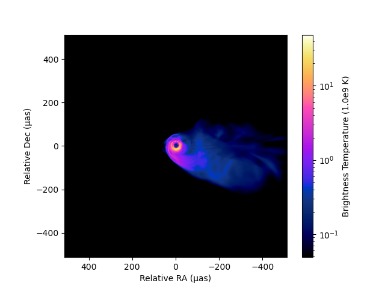

# In-memory Intensity Images
[`IntensityImage`](@ref) provides an in-memory implementation of the 5D intensity image. Internally, it uses a self-descriptive data set using the `DimStack` type of [EHTDimensionalData.jl](https://github.com/EHTJulia/EHTDimensionalData.jl), which is an extension of the powerful [DimensionalData.jl](https://github.com/rafaqz/DimensionalData.jl). Unless you are dealing with a huge size of images that will not fit within the memory of your computer, this will likely be the data type you will work with using this package.

## Loading an Image FITS file

Here, we will use a FITS image created by Python's eht-imaging library, which was used in [Chael et al. 2023](https://ui.adsabs.harvard.edu/abs/2023ApJ...945...40C/abstract). Let's download the data first.
```@example 1
using Downloads: download

# Download a FITS image
fitsname = download("https://github.com/achael/multifrequency_scripts/raw/main/sec_4.2/images_M87_Chael/M87_230GHz_Chael.fits")
```
A FITS file can be loaded into an [`IntensityImage`](@ref) instance using the [`load_fits`](@ref) method. This method utilizes [FITSIO.jl](https://github.com/JuliaAstro/FITSIO.jl), and you can also directly load data from an instance of the `FITS` data type in [FITSIO.jl](https://github.com/JuliaAstro/FITSIO.jl).
```@example 1
using EHTImages

# Load the FITS image into an IntensityImage instance
image = load_fits(fitsname)
```
All of the loaded intensity images, including their metadata, are loaded into the field `image.dimstack::EHTDimensionalData.DimStack`.
```julia
image.dimstack # will give an access to the dimstack instance storing all image data.
```
[`IntensityImage`](@ref) is *immutable*, so users cannot change the `DimStack` object associated with an [`IntensityImage`](@ref) instance to something else. However, arrays and metadata stored in the `DimStack` object are *mutable*. This allows users to flexibly edit data inside.

## Accessing to and editing data
You can access to the raw array of the intensity image in dimension of (x, y, polarization, fequency, time) by
```@example 1
image.data # return an array of intensity in the unit of Jy/pixel
```
You can access to the label or coordinates of each axis by
```@example 1
image.p # return an array of polarization labels in string
```
```@example 1
image.t # return an array of time in MJD
```
```@example 1
image.f # return an array of frequencies in Hz
```
Now you can see that this particular image is a single-frequency, single-stokes, and single-epoch image with 512 x 512 pixels. For the spatial extent, there is a dedicated method [`get_xygrid(::AbstractIntensityImage)`](@ref). By default, it returns a series of central coordinates in radians.
```@example 1
xygrid = get_xygrid(image)
```
or you can specify a unit in mutliple ways.
```@example 1
# use string
xygrid = get_xygrid(image, "μas")

# use Unitful
using Unitful
using UnitfulAngles
xygrid = get_xygrid(image, u"μas")

# use preload units in EHTUtils
using EHTUtils # preload units
xygrid = get_xygrid(image, μas)
```
Now you see that this image has a field of view of about 1022 μas in each axes. If you need to sample a vector from each you can simply use `collect(xygrid[1])`.

Metadata are stored in `OrderedDict`. You can access to metadata from the `metadata` field.
```@example 1
image.metadata # access to metadata
```
As noted eariler, arrays and metadata stored in [`IntensityImage`](@ref) instances are *mutable*. This allows users to flexibly edit data inside.
```@example 1
image.metadata[:observer] = "Wonderful Astronomer" # edit metadata
image.metadata
```

## Plotting Images
### Intensity map
The package currently relies on [PythonPlot.jl](https://github.com/stevengj/PythonPlot.jl) for image visualization. It has a customized [`imshow`](@ref) method for [`AbstractIntensityImage`](@ref) type.
```julia
using EHTUtils # for shortcuts to flux and angular units
using PythonPlot

f = figure()
ax = gca()
imshow(image, fluxunit=1e9K, angunit=μas, scale=:linear, cmap="viridis")
```
```
Dict{Any, Any} with 4 entries:
  "ylabelobj"   => <py Text(0, 0.5, 'Relative Dec (μas)')>
  "xlabelobj"   => <py Text(0.5, 0, 'Relative RA (μas)')>
  "colorbarobj" => <py matplotlib.colorbar.Colorbar object at 0x1803c3090>
  "imshowobj"   => <py matplotlib.image.AxesImage object at 0x180c20f10>
```


As you can see [`imshow`](@ref) will return all python objects in the generated plot so that users can further customize each component.

You can utilize a custom set of perceptually uniform colormaps implemented in the Python library [ehtplot](https://github.com/liamedeiros/ehtplot), which has been utilized in publications by the EHT Collaboration. To use these colormaps, follow the steps below to install ehtplot via [CondaPkg.jl](https://github.com/cjdoris/CondaPkg.jl) and import it using [PythonCall.jl](https://github.com/cjdoris/PythonCall.jl).
```julia
# Install CondaPkg.jl and PythonCall.jl (only needs to be executed once in your local/global Julia environment)
using Pkg
Pkg.add("CondaPkg")
Pkg.add("PythonCall")

# Install ehtplot (also only needs to be executed once in your local/global Julia environment)
using CondaPkg
CondaPkg.add_pip("ehtplot", version="@git+https://github.com/liamedeiros/ehtplot")
```
After installing ehtplot, you can import and utilize it for image visualization. For example:
```julia
using PythonCall  # provides the `pyimport` function
ehtplot = pyimport("ehtplot")

f = figure()
ax = gca()
# use "afmhot_us" colormap in ehtplot, a standard colormap used in the EHT Collaboration
imshow(image, fluxunit=1e9K, angunit=μas, scale=:linear, cmap="afmhot_us")
xlim(200, -200)
ylim(-200, 200)
```


You can also change a scale. `imshow` method has three options (`:linear`, `:log`, and `:gamma`). The dynamic range of `:log` scale contour can be controlled by `dyrange`.
```julia
f = figure()
ax = gca()
imshow(image, fluxunit=1e9K, angunit=μas, scale=:log, dyrange=1000, cmap="gnuplot2_us")
```


For gamma scale, the power low can be controled by `gamma`:
```julia
f = figure()
ax = gca()
imshow(image, fluxunit=1e9K, angunit=μas, scale=:gamma, gamma=0.5, cmap="cubehelix_u")
```


### Toolkit for a custom plot of images
Sometimes, users might want to create a custom function to plot images. There are some useful sets of methods to assist with this. Additionally, the source code for the [`imshow`](@ref) method would be helpful for learning how to use PythonPlot for custom plotting.
- [`get_imextent`](@ref) method: This method will return the extent of the image in the specified angular unit for the `PythonPlot.imshow`'s `extent` argument. Users can plot images with the actual angular scales using `PythonPlot.imshow(array, origin="lower", extent=imextent)`.
- [`get_bconv`](@ref) method: This method derives a conversion factor from Jy/Pixel (the unit for the `data` field) to an arbitrary unit of intensity.

## Saving into a FITS file
You can save a 3D cube of a sliced image using the [`save_fits!`](@ref)`(::AbstractIntensityImage, filename::AbstractString, idx=(1,1))` method. The `idx` parameter here represents the (time, frequency) indices, as popular image FITS formats do not support non-equidistant grids for time and frequency. The exported FITS file is compatible with CASA, AIPS, DIFMAP, and other EHT imaging packages (eht-imaging and SMILI).
```julia
save_fits!(image, './foobar.fits')
```

## Create a brank new image
You can create a blank 5D image directy with the [`intensitymap`](@ref) function. 
```@example
im = intensityimage(200, 1.0, μas)
```
You can specify also time, frequency, number of polarizations and all other metadata as well. Please see the docstring of [`intensitymap`](@ref) here.